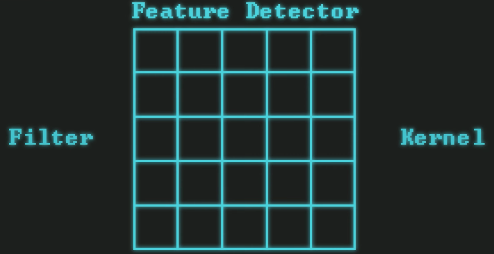
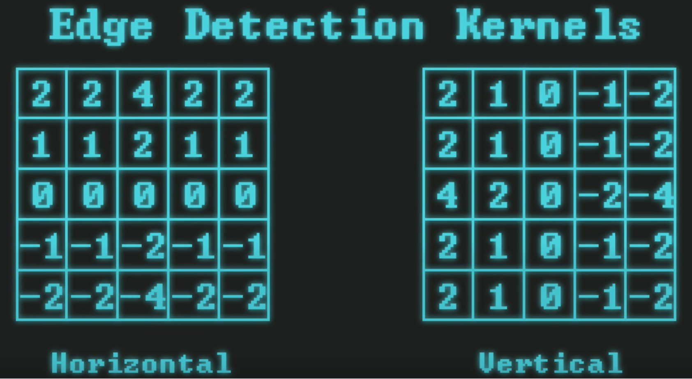
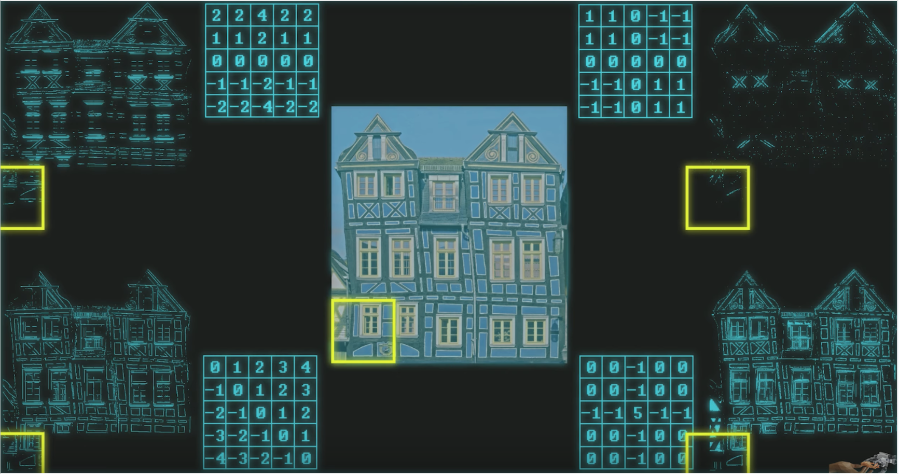

# IMAGE CLASSIFICATION BASICS

## Image Classification in the Context of Machine Learning

### The Field of Vision / Graphics
The field of Vision/Graphics encompasses a broad range of topics aimed at enabling machines to interpret and understand visual data in a manner similar to human vision.
1. :red_circle: **Image Classification:** Identifying the category or class of an object in an image.
2. **Object Detection:** Locating objects within an image and identifying their classes.
3. **Object Segmentation:**
   - **Semantic Segmentation:** Classifying each pixel of an image into a predefined category.
   - **Instance Segmentation:** Identifying each instance of each object class in an image at the pixel level.
4. **Pose Estimation:** Determining the orientation or pose of an object or person, often focusing on joint and limb detection for human figures.
5. **Face Recognition:** Identifying or verifying a person's identity based on their facial features.
6. **Image Inpainting:** Filling in missing or corrupted parts of an image in a visually plausible manner.
7. **Face Generation:** Using generative models to create new, realistic faces that do not correspond to real individuals.
8. **Image Super-Resolution:** Enhancing the resolution of an image, improving its quality and detail.
9. **Style Transfer:** Applying the style of one image to the content of another, often used for artistic purposes.
10. **Visual Question Answering (VQA):** Automatically answering questions about the content of an image.
11. **Scene Reconstruction:** Building a 3D model of a scene from one or more images.
12. **Action Recognition:** Identifying the actions or activities depicted in a video.
13. **Optical Character Recognition (OCR):** Converting typed, handwritten, or printed text into machine-encoded text from a scanned document or image.
14. **Anomaly Detection in Images:** Identifying unusual patterns or outliers in images that do not conform to expected behavior.
15. **Image-to-Image Translation:** Translating one representation of an image into another, such as day-to-night, summer-to-winter, or sketch-to-photo.
16. **Depth Estimation:** Estimating the distance from the viewpoint to the objects in an image, typically used for 3D scene understanding.
17. **Visual SLAM (Simultaneous Localization and Mapping):** Estimating the location of a sensor as it moves through a space while simultaneously creating a map of the environment.

## A bit of theory

Image classification involves two primary steps: `feature detection` and `classification`.

**Feature detection** can be efficiently performed using Convolutional Neural Networks (CNNs), which automatically detect important features without any human supervision. CNNs are designed to process data in the form of multiple arrays, ideal for image data, by applying filters to recognize patterns, edges, and textures.
The **classification** step often utilizes a feedforward network with dense nodes, known as a Fully Connected Layer (FCL), to classify the image into various categories based on the detected features. The FCL takes the high-level features identified by the CNN and combines them to make a final prediction.

For a detailed understanding, TensorFlow's tutorials provide a comprehensive guide on using CNNs for image classification: [TensorFlow Tutorials](https://www.tensorflow.org/tutorials/images/classification).

Additionally, the concept of feature detection and classification is well-detailed in the academic literature, such as the seminal paper by Krizhevsky et al., "ImageNet Classification with Deep Convolutional Neural Networks", available on [Neural Information Processing Systems](https://papers.nips.cc/paper_files/paper/2012/file/c399862d3b9d6b76c8436e924a68c45b-Paper.pdf).

## Transfer Learning
Transfer learning is a machine learning technique where a model developed for one task is reused as the starting point for a model on a second task. It is a popular approach in deep learning because it can train deep neural networks with comparatively little data. This is very useful in the field of computer vision, where pre-trained models are often used as the basis for tasks like image classification, object detection, and more.

### How Transfer Learning Works
1. **Pre-Trained Model:** The process begins with a model that has been pre-trained on a large dataset, typically on a wide-ranging task such as classifying images into one of 1,000 categories in ImageNet. This model has learned a lot of features from this extensive dataset, which can be generic features like edges, textures, or more complex patterns.
2. **Feature Extraction:** You use the pre-trained model as a feature extractor by removing the output layer(s) that made predictions on the original dataset. This leaves you with a model that can output a feature vector for any input image, encapsulating the "knowledge" it has about the image's content based on the features learned from the original dataset.
3. **Task-Specific Layer(s):** You then add one or more layers on top of the pre-trained model to learn the features specific to your new task. Only these layers will be trained from scratch. You can choose to freeze the weights of the pre-trained layers, so only the new layers learn from the new task's data, or fine-tune some of the deeper layers to adapt their features to the new task.

### Benefits of Transfer Learning
- **Efficiency:** Training deep learning models from scratch requires a lot of data and computational power. Transfer learning allows you to leverage existing neural networks, significantly reducing the resources required for training.
- **Speed:** Models can be trained much faster because the base layers already contain a lot of useful information about the data.
- **Performance:** Transfer learning can improve the performance of models on tasks with limited data by introducing more generalizable features learned from a larger dataset.

### Use Cases
- **Image Classification:** Starting from a model pre-trained on ImageNet to classify images into new categories with relatively little data.
- **Object Detection:** Using feature extractors from models trained on large datasets to detect objects in images.
- **Natural Language Processing (NLP):** Models pre-trained on large text corpora can be fine-tuned for tasks like sentiment analysis or question answering.

### Popular Pre-Trained Models for Transfer Learning
- **In Computer Vision:** VGG, ResNet, Inception, and MobileNet.
- **In NLP:** BERT, GPT, and RoBERTa.

Transfer learning has become a cornerstone of machine learning because it enables the development of powerful models without the need for enormous datasets or extensive computational resources, making advanced ML tasks accessible to a broader audience.

## Features
In the context of Convolutional Neural Networks (CNNs) used for image processing, features can be categorized into three levels based on their complexity and abstraction: low-level, mid-level, and high-level features.

### Low-Level Features

Low-level features are the basic building blocks of an image, typically captured in the initial layers of a CNN. These features include edges, corners, colors, and textures. They are straightforward, simple patterns that do not convey much about the content of the image but are crucial for the initial stage of processing. For example, detecting the boundaries and basic shapes within an image falls under low-level feature detection.

### Mid-Level Features

As we move deeper into the network, the CNN starts to combine low-level features to form mid-level features. These features represent more complex patterns that can be interpreted as parts of objects within the image, such as wheels, windows (in the context of vehicles), or eyes and mouths (in the context of faces). Mid-level features bridge the gap between simple patterns and the recognition of whole objects, capturing the essence of object parts without identifying the object as a whole.

### High-Level Features

High-level features are detected in the deeper layers of the CNN. These features represent entire objects or even scenes, incorporating a high level of abstraction and complexity. At this stage, the network has combined lower-level features to recognize complex patterns and objects, such as cars, trees, or human faces. High-level features allow the network to make decisions about what is present in the image, leading to classifications or identifications in tasks like image recognition, object detection, and scene understanding.

The progression from low-level to high-level features in a CNN mirrors the way humans visually process information: starting from basic visual cues and moving towards complex interpretations. This hierarchical processing enables CNNs to effectively handle a wide range of image recognition and classification tasks by learning to recognize patterns of increasing complexity.

## Filter / Feature Detector / Kernel
In the context of Convolutional Neural Networks (CNNs), the terms filter, feature detector, and kernel are often used interchangeably to refer to the same concept. These elements are fundamental to the operation of CNNs, enabling them to perform feature extraction from input images.

**Definition:** A filter (also known as a feature detector or kernel) is a small matrix used to apply transformations to the input image. Filters are designed to detect specific types of features in the image, such as edges, textures, or patterns.

**Operation:** The process of applying a filter to an image is known as convolution. During convolution, the filter is slid (or convolved) across the image, and at each position, a dot product is computed between the filter and the portion of the image it covers. This operation produces a new matrix called a feature map or activation map, which highlights the areas of the image where the specific pattern of the filter is found.

**Purpose:** Filters are used to extract various features from the input image, making it easier for the network to understand and interpret the image. By applying multiple filters, a CNN can detect a wide range of features at different levels of abstraction, from simple edges to complex objects.

**Learning:** In modern CNNs, the values within these filters are not hand-engineered but learned automatically during the training process. The network adjusts the values of the filters based on the training data, enabling it to learn the most relevant features for the task at hand, whether it be image classification, object detection, or another image-related task.

**Depth:** In deep learning, a CNN can have multiple layers of convolution, each with its own set of filters. The filters in the initial layers tend to detect low-level features (such as edges and textures), while the filters in deeper layers are capable of detecting higher-level features (such as parts of objects or entire objects).

By using filters, CNNs can progressively extract more meaningful and complex features from raw pixel data, which is crucial for performing various vision-based tasks with high accuracy. This mechanism allows CNNs to build a deep understanding of images, making them powerful tools for image analysis and interpretation.